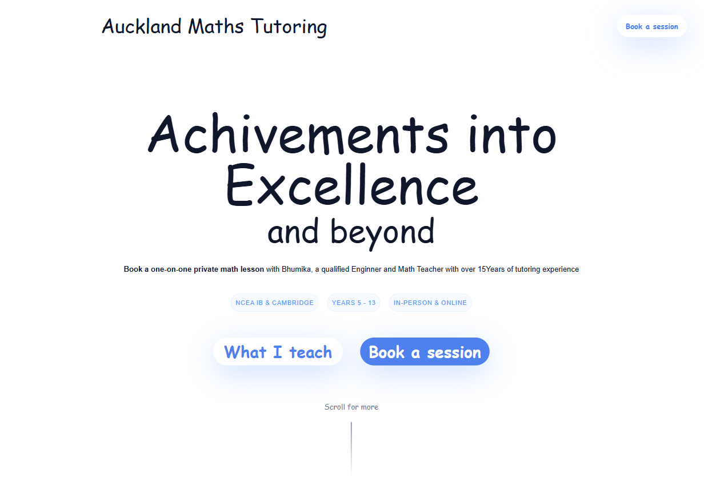

# Auckland Maths Tutoring Landing Page

This is a responsive landing page for a fictional tutoring service — **Auckland Maths Tutoring** — built using **React**, **Vite**, and **Tailwind CSS**.



> 🧠 _Preview of the landing page above. Live demo coming soon!_

This project was created for learning and skill-building purposes by following a YouTube tutorial by [**SmallJames**](https://youtu.be/GcX4iEhDgM8?si=5JFeXo6TSARQmTXZ).

## 🚀 Features

- Built with **React** and **Vite** for fast development
- Styled using **Tailwind CSS** with utility-first classes
- Fully responsive layout with clean design
- Sections included:
  - Hero section with introduction
  - About tutoring services
  - Benefits of the program
  - Testimonials from students
  - Contact CTA

## 🧰 Tech Stack

- **React**
- **Vite**
- **Tailwind CSS**

## 📦 Installation

To run this project locally:

```bash
git clone https://github.com/your-username/auckland-maths-tutoring.git
cd auckland-maths-tutoring
npm install
npm run dev


## 📌 Credits

This project is based on a tutorial by [SmallJames](https://www.youtube.com/@SmallJames), and was built for educational purposes only.
Check out the original video here: [https://youtu.be/GcX4iEhDgM8](https://youtu.be/GcX4iEhDgM8)
```
